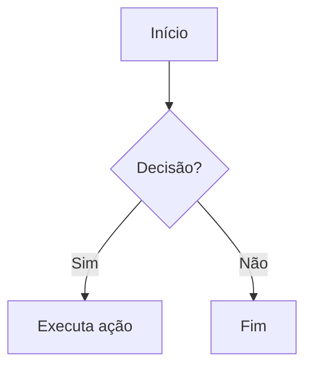
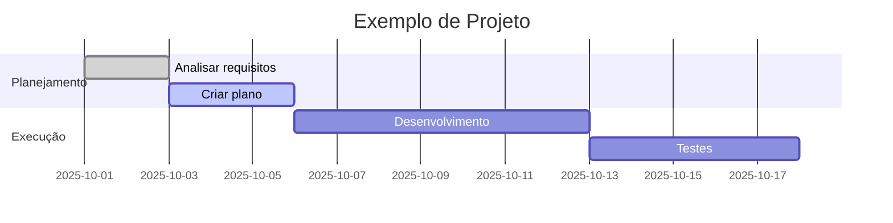

# 🌟 Exemplo Completo de Markdown

Este documento mostra **vários recursos do Markdown** para deixar seus arquivos mais interessantes e informativos.

---

## 📑 Índice
1. [Texto e Listas](#-texto-e-listas)
2. [Links e Imagens](#-links-e-imagens)
3. [Códigos](#-códigos)
4. [Tabelas](#-tabelas)
5. [Checklists](#-checklists)
6. [Citações](#-citações)
7. [Diagramas Mermaid](#-diagramas-mermaid)
8. [Matemática (LaTeX)](#-matemática-latex)

---

## 📝 Texto e Listas

### Listas não ordenadas:
- Item comum
- **Item em negrito**
- *Item em itálico*
  - Subitem
    - Sub-subitem

### Listas ordenadas:
1. Primeiro
2. Segundo
3. Terceiro

---

## 🔗 Links e Imagens

[Visite o GitHub](https://github.com)  

Imagem exemplo:  


---

## 💻 Códigos

Exemplo de código em **Python**:

```python
def soma(a, b):
    return a + b

print(soma(3, 5))
```

---

## 📊 Tabelas

| Nome       | Idade | Profissão       |
|------------|-------|----------------|
| Ana        | 25    | Engenheira     |
| Bruno      | 30    | Designer       |
| Carlos     | 28    | Desenvolvedor  |

---

## ✅ Checklists

- [x] Criar exemplo Markdown  
- [ ] Revisar formatação  
- [ ] Compartilhar com a equipe  

---

## 💬 Citações

> "Markdown é simples, mas poderoso!"  
> — Alguém inspirado

---

## 📈 Diagramas Mermaid

### Fluxograma


### Diagrama de Gantt


---

## 🔢 Matemática (LaTeX)

Equação de segundo grau:  

$$x = \frac{-b \pm \sqrt{b^2 - 4ac}}{2a}$$  

Integral:  

$$\int_0^\infty e^{-x^2} dx = \frac{\sqrt{\pi}}{2}$$

---

## 🎉 Conclusão

Este arquivo `.md` reúne **recursos variados** para deixar sua documentação mais **rica e atrativa**.
